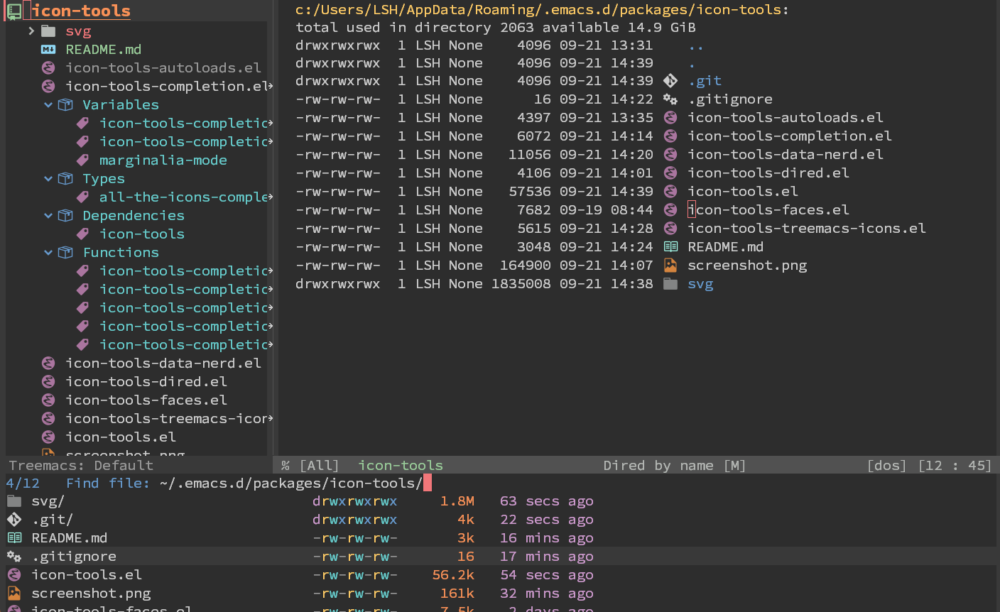

# Icon-tools for Emacs


Icon-tools makes inserting icons in Emacs graceful and painless. It uses SVG icons in GUI Emacs and [Nerd font](https://www.nerdfonts.com/) icons in TUI Emacs.

It is partially meant as an alternative to [`all-the-icons`](https://github.com/domtronn/all-the-icons.el) to provide better looking and experience.

## Main features

1. Perfect alignment. The SVG icons are perfectly aligned both horizontally and vertically.
2. Supports both GUI and TUI Emacs.
3. (Additionally) provides icon support for several use cases, including [`Treemacs`](https://github.com/Alexander-Miller/treemacs), `Dired`, and minibuffer completion.
4. Caching implementation. The SVG icons are cached so as to save memory and speed up performance.

## Getting started

This package is not in Melpa, therefore manual installation is needed.

First, clone the repo:

``` shell
git clone --depth=1 https://github.com/liushihao456/icon-tools.git
```

Then add `icon-tools` to load-path:

``` elisp
(add-to-list 'load-path "/path/to/icon-tools/")

;; Minibuffer completion icons
(require 'icon-tools-completion)
(icon-tools-completion-mode t)

;; Dired icons
(require 'icon-tools-dired)
(add-hook 'dired-mode-hook 'icon-tools-dired-mode)

;; Treemacs icons
(require 'icon-tools-treemacs-icons)
(icon-tools-treemacs-icons-config)
```

## Basic usage

To build an icon, just evaluate (for example):

``` elisp
(icon-tools-icon-str "repo")
;; or
(icon-tools-icon-str "repo" 'face-to-use)
```

It will return a string containing the icon that can be inserted.

## Special thanks

This package is based largely on these excellent projects:

* [`all-the-icons`](https://github.com/domtronn/all-the-icons.el)
* [`all-the-icons-dired`](https://github.com/jtbm37/all-the-icons-dired)
* [`all-the-icons-completion`](https://github.com/iyefrat/all-the-icons-completion)
* [`doom-themes-treemacs`](https://github.com/doomemacs/themes)
* [`emacs-svg-icon`](https://github.com/rougier/emacs-svg-icon)

